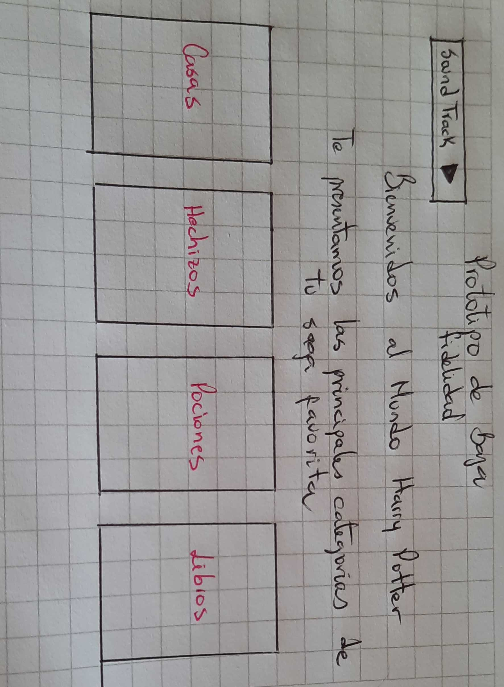
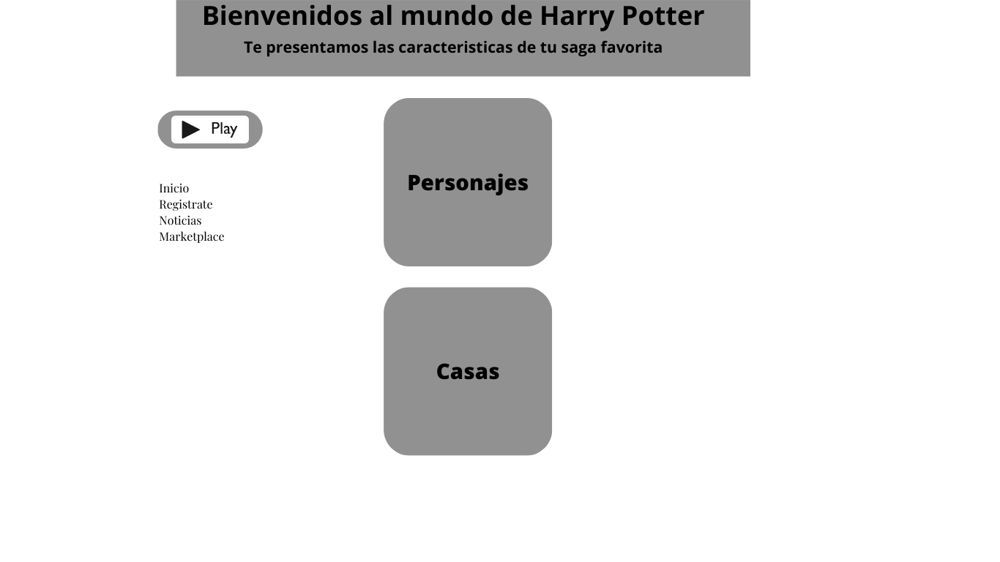
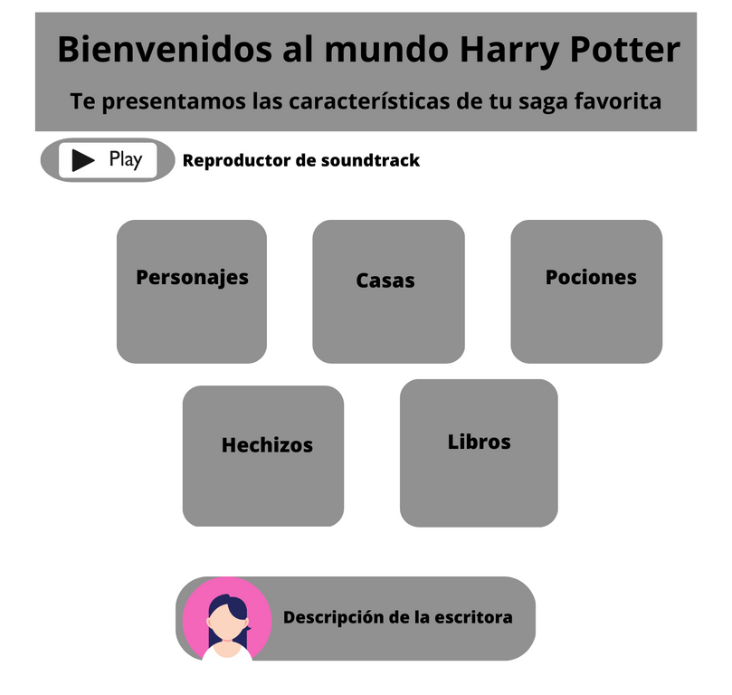
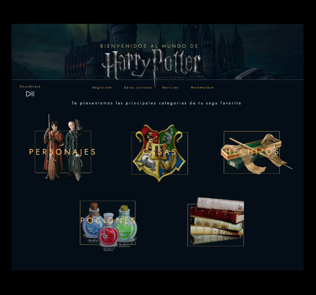
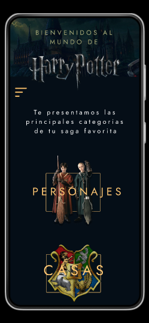

# Data Lovers

## Índice

* [1. Definición de Producto](#1-definicion-de-producto)
* [2. Historias de Usuario](#2-historias-de-usuario)
* [3. Prototipo de Baja Fidelidad](#3-prototipo-de-baja-fidelidad)
* [4. Prototipo de Alta Fidelidad](#4-prototipo-de-alta-fidelidad)
* [5. Test de Usabilidad](#5-test-de-usabilidad)
* [6. Criterios Minimos de Aceptación](#6-criterios-minimos-de-aceptación)

***

## 1. Definición del Producto

En este proyecto se tiene como principal objetivo procesar data, desplegandola
traves de una _interfaz_ amigable y entendible para el usuario. La forma en la que
se proceso el conjunto de datos fue manipulandola para poder visualizarla, ordenarla
y filtrarla, además de poder obtener un cálculo agregado. 

La data elegida en este proyecto fue sobre Harry Potter, por lo que estas funciones anteriormente
mencionadas se presentan al usuario en una página web que contiene un diseño que evoque a las peliculas y libros de la franquicia,
utilizando colores, imagenes y formas representativas, facilmente identificables para un fan o un espectador casual. 

Por lo tanto, este proyecto pretende servir como un medio de consulta para un fan o un espectador casual, facilitando el acceso a diferentes topicos de la franquicia, para poder inmiscuirse en el mundo de harry potter.

## 2. Historias de Usuario

* HU 1. Visualizar data

_"Yo como seguidora de la franquicia de Harry Potter, quiero visualizar un catálogo que me muestre categorías como personajes, casas, hechizos, pociones y libros , para complementar mis conocimientos como fan."_

* HU 2. Filtrar data

_"Yo como fan de Harry Potter, quiero filtrar los personajes por casa, para poder identificar características en común de los estudiantes que admite cada una."_

* HU 3. Ordenar data

_" Yo como espectador de Harry Potter, quiero ver las pociones por orden alfabético para poder consultarlas y conocer mas de ellas."_

* HU 4. Calculo agregado

_"Yo como usuaria, quiero saber el promedio de mujeres y hombre y el total de estudiantes en las casas , para conocer la inclusión de las mujeres en Hogwarts."_

## 3. Prototipo de Baja Fidelidad

Los primeros prototipos de baja fidelidad, buscando una buena distribución de cada uno de los elementos.

A traves del feedback que recibimos, agregamos algunos cambios mostrados a continuación:

## 4. Prototipo de Alta Fidelidad

* Version Desktop: [Link](https://www.figma.com/file/n0PUF45bqgsd5wmmd5KFt6?node-id=0:1&comments-enabled=1&viewer=1&locale=en)

* Version Responsive: [Link](https://www.figma.com/file/n0PUF45bqgsd5wmmd5KFt6?node-id=81:2&comments-enabled=1&viewer=1&locale=en)

## 5. Test de Usabilidad

Se realizaron diferentes test de usabilidad para detectar errores o inconvenientes que el usuario
podria presentar en el momento de navegar en el sitio web.

Los problemas que se detectaron en los test de usabilidad fueron los siguientes:

Version Desktop:

* Algunos textos no estaba centrados, y eso no era visualmente comodo para el usuario.
* Los colores empleados en la lista de las pociones no combinaba con el resto de la página.
* Las cards de personajes que no presentaban una imagen adherida se veian muy vacias.

Versión responsive:

* El tamaño de la letra era demasiado grande por lo que las palabras salian de los limites de la 
  pantalla.
* Algunas imagenes ocupaban mucho tamaño, por lo que el usuario presentaba problemas de navegación
 al tener que desplegarse de manera horizontal para visualizar toda la imagen.
* El icono x para cerrar el menu desplegable no era visible.
* Se presentarón modificaciones de estilos al visualizar la página en diferentes dispositivos celulares:
  las imagenes sobrepuestas una sobre otra se acomodaban de diferente forma. 

El proyecto fue iterando a traves de todos estos problemas detectados, dandoles solución y llegando asi a la versión final.

## 6. Criterios Minimos de Aceptación

- [x] Cumple con los criterios minimos de 4 Historias de Usuario
- [x] El proyecto no presenta errores de eslint
- [x] Las pruebas unitarias cubren el 100% de statements, functions, lines y branches.
- [x] El codigo esta subido al repositorio de GitHub.
- [x] El proyecto esta desplegado en GitHub Pages
- [x] El README contiene una definición del producto e Historias de Usuario.